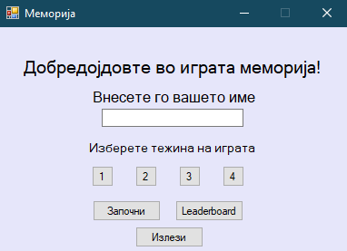
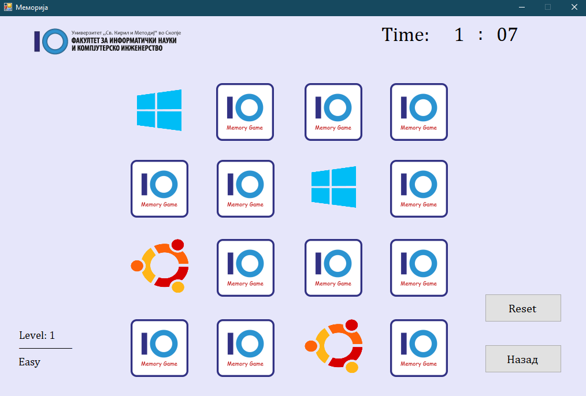
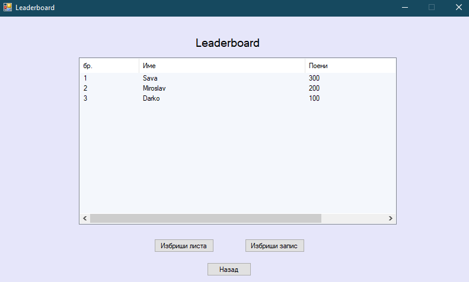

## <p align="center">Проект по предметот Визуелно програмирање</p>

# <p align="center">Меморија</p>

## Направено од: 

| Име и Презиме | Број на индекс |
| :-----------: | :------------: |
| Мирослав Радиќ | 181186        |
| Сава Стевановиќ | 181583       |
| Дарко Скерлевски | 183049      |


## Опис на апликацијата
<p align="justify">
Апликацијата што ја направивме е играта меморија во која целта е да се погодат парови на исти
слики. На почетокот сите слики се покриени и дозволено е да се откријат максимум две слики во еден момент.
Доколку отворените слики не се исти, се затвораат и двете при што задачата на играчот е да запомни
кои се сликите што се затворија со цел да може да ги спои доколку пронајде друга слика која е иста со
една од претходно отворените. Повеќе за играта меморија може да се прочита <a href="https://en.wikipedia.org/wiki/Concentration_(card_game)" target="_blank">тука</a>.
Ние ја имплементиравме така што играчот треба да ги погоди сите парови пред да му истече поставеното
време. Играчот на почетокот пред да почне со играта го внесува своето име кое се користи за да се
запише во leaderboard доколку играчот ја победи играта односно ги погоди сите парови. Исто така на
почетокот пред да започне играта потребно е играчот да избере тежина на играта. Постојат 4 нивоа
односно Easy, Medium, Hard и Impossible. Во првите две нивоа има 4x4 слики кои треба да се погодат
или 8 пара, додека во 3 и 4 ниво има 4x6 слики или 12 пара. Првото од второто ниво односно третото од четвртото
се разликуваат по тоа што времето кое што играчот го има за да ги погоди паровите е различно.
Кога играчот ќе ги погоди сите парови слики играта завршува и притоа неговото име и поени се
запишуваат во leaderboard. Доколку претходно постои запис со исто име, но поените на играчот се
поголеми од запишаните се запишуваат новите поени, во спротивно остануваат старите. Доколку се 
отвори leaderboard и за внесеното име на играчот постои запис, тогаш тој ред ќе биде обоен со жолта
боја со цел да се одвои од останатите записи. 
</p>

## Screenshots


### <p align="center"> Почеток </p>

<p align="center">  </p>

### <p align="center"> Во игра </p>

<p align="center">  </p>

### <p align="center"> Leaderboard </p>

<p align="center">  </p>


## Имплементација

### Start.cs

<p align="justify">
При стартување на апликацијата се појавува почетната форма (Start.cs). Со стартување на формата
се проверува дали веќе постои csv датотека за чување на поените, доколку не постои тогаш се креира
со следниот код: 
</p>

```c#

if (!(File.Exists("../../leaderboard.csv"))) 
    {
        var newFile = File.Create("../../leaderboard.csv");
        newFile.Close();
    } 

```
<p align="justify">
Исто така се иницијализира bool променлива со која се одредува дали копчето за тежина е притиснато.
</p>

```c#

private bool tezina = false;

```
<p align="justify">
Напишавме наша класа за копче која наследува од класата Button со една разлика, тоа што
не може да се селектира копчето со цел да не се дава фокус на наредното копче кога едно е
притиснато. 
</p>

```c#

class NoSelectButton : Button 
    {
        public NoSelectButton()
        {
            SetStyle(ControlStyles.Selectable, false);
        }
    }
	
```
### Form1.cs (Form2.cs)

<p align="justify">
Откако играчот ќе ги исполни одредените услови за започнување на играта (името да е поголемо од
два карактери, да не е поголемо од 20 и да има избрано тежина) се отвара нова форма во зависност
од тоа кое ниво на тежина го избрал играчот. Доколку избрал 1 или 2, тогаш се стартува Form1, а
во спротивно односно 3 или 4, се стартува Form2. Кодот на Form1 и Form2 е скоро идентичен со
таа разлика што има осум дополнителни Pictureboxes и затоа ќе го опишеме само на Form1.
</p> 

<p align="justify">
При стартување на играта се проверува тежината која е избрана од страна на играчот и притоа во две
листи се ставаат позадините и pictureBox-овите. Се иницијализира и timer кој што добива минути и
секунди во зависност од тоа кое ниво на тежина е избрано. Дополнително имаме две низи, една за одредување 
која слика да оди на која позиција и другата за евиденција на која слика колку пати била употребена
(дозволено е 2 пати).
</p> 

```c#

List<PictureBox> listaCover = new List<PictureBox>(16);
List<PictureBox> lista = new List<PictureBox>(16);
int[] niza = new int[16];
int[] pomosna = { 0, 0, 0, 0, 0, 0, 0, 0 };

```

```c#

private void timer3_Tick(object sender, EventArgs e)
{
	
	int min = Int32.Parse(timerMin.Text);
	int sec = Int32.Parse(timerSec.Text);

	sec--;
	if(sec == -1 && min != 0)
	{
		min--;
		sec = 59;
	}
	if (sec < 10)
	{
		timerSec.Text = "0" + sec.ToString();
	}
	else
	{
		timerSec.Text = sec.ToString();
	}
	timerMin.Text = min.ToString();

	if (sec <= 0 && min <= 0)
	{
		timer3.Stop();
		timer3.Dispose();
		timer3.Enabled = false;
		izgubiGame();
	}
}

```

<p align="justify">
Се генерира рандом број со функцијата random.Next() во ранг од 0 до 64 и правиме модуло 8
со цел да добиеме број од 0 до 7. Со for цилкус се ставаат сликите на места по случаен избор
и for циклусот трае се додека нема слика на секое место.
</p> 

```c#

for (int i = 0; i < 16; i++)
{
	int x = random.Next(0, 64) % 8; // Генерирање рандом број од 0 до 7
	if (pomosna[x] < 2)
	{
		pomosna[x]++; // се забележува појавување
		niza[i] = x; // одредување слика за таа позиција
	}
	else
	{
		i--; // во случај да се појави трето појавување на број да пробаме пак за истата позиција
		continue;
	}
	
	...
	
}
	
```

<p align="justify">
Кога ќе се стисне на една позадина, сликата се превртува а доколку веќе има една отворена слика тогаш 
се проверува дали двете слики се исти. Исто така тука се проверува дали сите парови се погодени и
доколку се играта завршува, во спротивно продолжува.
</p> 

```c#

private void pictureBox17_Click(object sender, EventArgs e)
{

    if (!prvSelektiran)  // првично е false
    {
        prvSelektiran = true;
        box1 = (PictureBox)sender;
        clicked(box1);
    }
    else
    {
        box2 = (PictureBox)sender;
        clicked(box2);
    }
}
	
```

```c#

private void clicked(PictureBox box)
{
    zaAnimiranje = box;
    timer1.Start();
    if (flag)
    {
        secondSelectedValue = box2.Tag.ToString();
        if (firstSelectedValue.Equals(secondSelectedValue))
        {
            
            SoundPlayer sound = new SoundPlayer(Properties.Resources.success); // погоден пар
            sound.Play();
            flag = false;
            prvSelektiran = false;             
            firstSelectedValue = "";
            secondSelectedValue = "";
            counter++;
            if (counter == 8)
            {
              ...  // сите парови се погодени -играта завршува
            }
            return;
        }
        else
        {
            firstSelectedValue = "";
            secondSelectedValue = "";
            zaAnimiranje1 = box1;
            zaAnimiranje2 = box2;
            SoundPlayer sound = new SoundPlayer(Properties.Resources.beep);       // згрешен пар
            sound.Play();
            var w = new Form() {  }; 
            w.WindowState = FormWindowState.Minimized;
            Task.Delay(TimeSpan.FromSeconds(1)).ContinueWith((t) => w.Dispose(), TaskScheduler.FromCurrentSynchronizationContext());
            w.ShowDialog();
            timer2.Start();
            flag = false;
            prvSelektiran = false;
            return;
        }
    }

    flag = true;	// притисната е една слика
    firstSelectedValue = box1.Tag.ToString();
}
		
```
	
### leaderboard.cs

<p align="justify">
Leaderboard функционира така што ги чува сите записи во csv датотека и од неа чита за да ги
запише податоците во табелата. За имплементација на leaderboard-от ја користиме формата ListView
каде што направивме три колони - за реден број, име и поени. При стартување на формата се
вчитуваат сите податоци од csv датотеката преку функцијата updateLeaderBoard().
</p> 

```c#

private void updateLeaderBoard()
{
    var lines = File.ReadAllLines("../../leaderboard.csv").Select(x => x.Split(',').ToArray()).OrderByDescending(x => Int32.Parse(x[1])).ThenBy(x => x[0]).Select(x => string.Join(",", x));
    int i = 1;
    foreach (String line in lines)
    {
        var x = line.Split(',').ToArray();
        if (!(line.Equals("")))
        {
            ListViewItem lvi = new ListViewItem(i.ToString());
            listView1.FullRowSelect = true;
            if (this.ime.Equals(x[0]))
                lvi.BackColor = Color.Yellow;
            lvi.SubItems.Add(x[0]);
            lvi.SubItems.Add(x[1]);
            listView1.HideSelection = false;
            listView1.Items.Add(lvi);
        }
        i++;
    } 

}

```

<p align="justify">
Се читаат сите записи од датотеката со функцијата ReadAllLines() кои веднаш се сортираат по
опаѓачки редослед по број на поени, а потоа по име. Со for циклусот се изминуваат сите линии
една по една и се додава секој запис во нов ред од listView и притоа доколку има запис
за името на играчот кој што претходно е внесен, тогаш се обојува тој ред со жолта боја.
</p> 

<p align="justify">
Копчето за да се избрише leaderboard-от е имплементирано така што кога е стиснато
се брише csv датотеката и се креира нова(празна) на нејзино место и се тргаат
сите елементи од ListView.
</p> 

```c#

File.Delete("../../leaderboard.csv");
var newFile = File.Create("../../leaderboard.csv"); 
newFile.Close();
listView1.Items.Clear();

```
<p align="justify">
Копчето за бришење на еден запис е имплементирано така што кога е стиснато се испраќа редот
кој е селектиран во ListView, се тргаат сите елементи од ListView, се читаат сите записи од csv 
датотеката, се брише и се креира нова во која се запишуваат сите претходно запишани редови освен
тој ред кој бил селектиран во ListView и повторно се ажурира leaderboard-от.
</p> 

```c#

string del = listView1.SelectedItems[0].SubItems[0].Text.ToString()+ ". " + listView1.SelectedItems[0].SubItems[1].Text.ToString() + " " + listView1.SelectedItems[0].SubItems[2].Text.ToString();
listView1.Items.Clear();
var lines = File.ReadAllLines("../../leaderboard.csv").Select(x => x.Split(',').ToArray()).OrderByDescending(x => Int32.Parse(x[1])).ThenBy(x => x[0]).Select(x => string.Join(",", x));
File.Delete("../../leaderboard.csv");
var newFile = File.Create("../../leaderboard.csv"); 
newFile.Close();
using (var output = new StreamWriter("../../leaderboard.csv")) 
{
    int i = 1;
    foreach (string line in lines)
    {
        var x = line.Split(',');
        var lineX = String.Format(i + ". " + x[0] + " " + x[1]);
        if (!(lineX.Equals(del)) && !(line.Equals("")))
        {
            output.WriteLine(x[0] + "," + x[1]);
        }
        i++;
    }
}
updateLeaderBoard();
	
```
